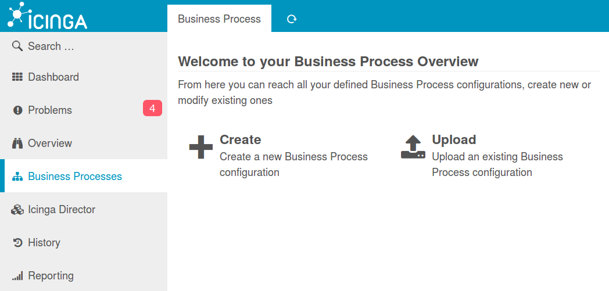
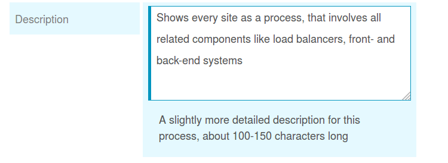
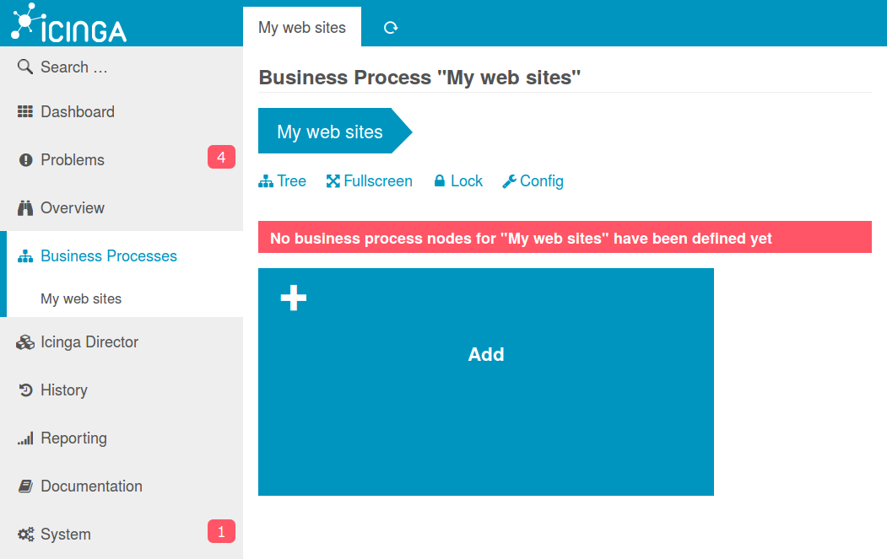

Getting Started
===========================================

Once you enable the *Business Process* module, it will pop up in your menu.
When you click on it, it will show you a new Dashboard:

A new Business Process configuration
-------------------------------------------

From here we choose to create a new *Business Process configuration*:

Let's have a look at the single fields:

### Configuration name

The Business Process definition will be stored with this name. This is going to
be used when referencing this process in URLs and in Check Commands. You might
optionally want to provide an additional title. In that case the title is shown
in the GUI, while the name is still used as a reference. The title will default
to the name.

### Description

Provide a short description explaining within 100-150 character what this
configuration provides. This will be shown on the Dashboard.

### Backend

**Hint:** *Usually this should not be changed*

Icinga Web 2 currently uses only one Monitoring Backend, but in theory you
could configure multiple ones. They won't be usable in a meaningful way at the
time of this writing. Still, you might want to use a different backend as a data
provider for your Business Process.

### State Type

You can decide whether `SOFT` or `HARD` states should be the used as a base when
calculating the state of a Business Process definition.

### Add to menu

Business Process configurations can be linked to the Icinga Web 2 menu. Only the
first five configurations a user is allowed to see will be shown there:

That's all for now, click `Add` to store your new (still empty) Business Process
configuration.

Empty configuration
===================

You are redirected to your newly created Business Process configuration:

From here we can now add as many deeply nested Business Processes as we want.
But let's first have a look at our Dashboard once again:

Now let's move on and create some Nodes.